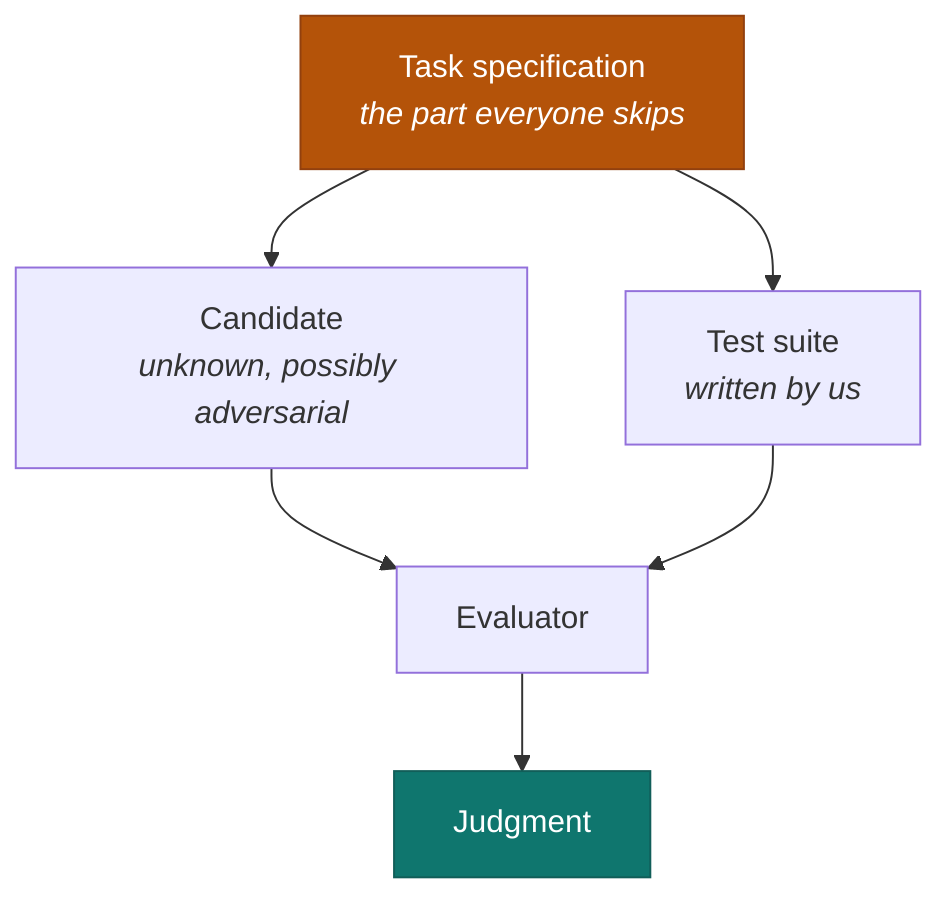
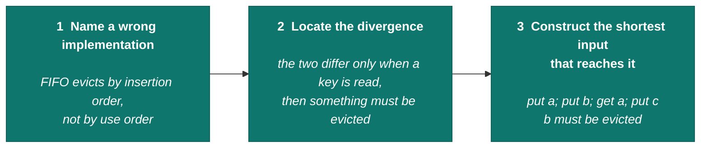
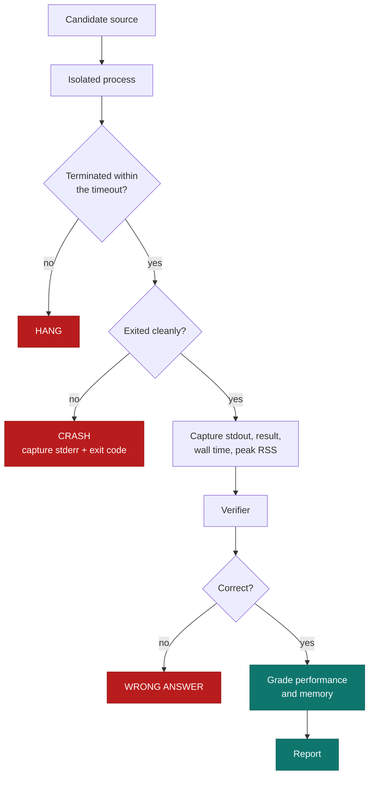
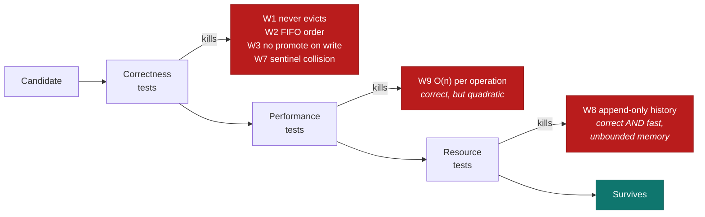
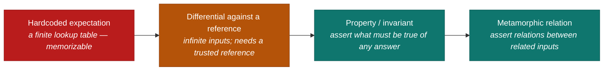
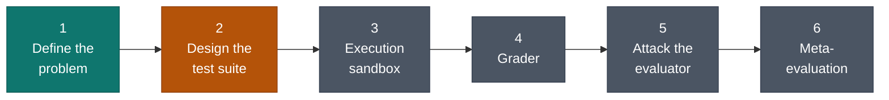
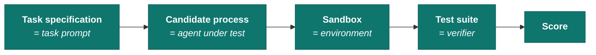

# Model Evaluator

An execution and grading harness for untrusted candidate code — built to study the
harder problem sitting underneath it: **how do you know your evaluation is any good?**

---

## The problem

Automated evaluation looks like a solved problem. Run the candidate against a test suite,
count the passes, report a score. The number is the easy part. The difficult question is
what it entitles you to believe.

A score is never a measurement of the candidate alone. It is a joint measurement of the
candidate **and the instrument**. When the instrument is weak, the score is mostly about
the instrument.



Three systems are under evaluation, not one. Most evaluation failures are not sandbox bugs —
they are specification failures, where the task was loose enough that the candidate's answer
was defensible and the verifier called it wrong anyway.

## The result that motivates this project

This repository evaluates implementations of an LRU cache. Below is a real run of the four
tests a competent developer writes by instinct, against two candidates: a correct LRU, and a
FIFO cache masquerading as one.

```
SUITE A — the tests you'd write without thinking about it
----------------------------------------------------------
test                                   correct        fifo
N1  basic put/get                         PASS        PASS
N2  overwrite a value                     PASS        PASS
N3  two keys, both under capacity         PASS        PASS
B1  inserting past capacity evicts        PASS        PASS
----------------------------------------------------------
score                                      4/4         4/4
```

Everything green — and the suite cannot distinguish an LRU cache from a FIFO cache, which is
the only property the task is about. Its **discriminating power is zero**: every candidate
receives an identical score, so the instrument outputs a constant.

One further test, derived rather than brainstormed, changes that:

```
SUITE B — same, plus one test derived from a named bug
----------------------------------------------------------
R1  a read counts as a use                PASS        FAIL
----------------------------------------------------------
score                                      5/5         4/5
```

## How a test is derived

`R1` was not found by brainstorming edge cases. It was constructed by a mechanical procedure,
and that procedure is the transferable skill in this repository.



The developer instinct is *"what inputs are weird?"* The evaluation instinct is
*"what wrong code would survive?"*

## How evaluation runs

The harness is being built to this shape. Failures are not a flat list of test results —
they are distinct outcomes reached at different stages, and the early stages gate the later
ones.



A candidate that does not terminate has no meaningful performance score. Correctness gates
everything downstream of it. This is why a score is not a sum.

> Today `runner/step0.py` implements the verifier stage only. Isolation, capture and grading
> are phases 3 and 4.

## What gets measured, and what dies where

Each layer of testing kills a different class of wrong implementation. The layering matters
because some failures are invisible to everything above them.



`W8` is the case that justifies measuring resources at all. It tracks recency by appending
every access to a list and lazily skipping stale entries: functionally correct, amortized
O(1), passes every correctness test and every timing test, and fails only on memory.

## Design principles

Each rule below was derived from a concrete failure, not adopted on principle.

**A task is well-formed only if you can state its oracle before you write it.**
Verifiability is an authoring-time constraint, not a downstream concern. Writing the
specification here surfaced that the textbook LRU formulation — `get` returns `-1` on a miss —
is *unverifiable*: the miss signal lives inside the value domain, so storing `-1` is
indistinguishable from a cache miss. The task had to change, not the grader.

**Every test names the wrong implementation it kills.** A test that cannot name one is
decoration.

**A test that every candidate passes carries no information.** This is measurement, not
quality assurance.

**Oracles are ranked by their resistance to gaming.**



**Coverage is measured against specification clauses, not code lines.** Line coverage
measures the candidate. Clause coverage measures us.

## Repository layout

```
docs/
  01-task-spec-lru-cache.md   public specification — the exact text a candidate sees
  02-test-plan-lru-cache.md   private test plan — catalogue of wrong implementations
reference/
  naive.py                    the oracle: O(n), slow, auditable by eye
candidates/
  correct.py                  a genuinely correct O(1) implementation
  fifo.py                     evicts by insertion order — the common wrong answer
runner/
  step0.py                    discrimination demonstration
```

The separation between the public specification and the private test plan is structural, not
organisational. A candidate that can read the test plan can satisfy it without implementing
the specification.

## Quick start

Requires Python 3.12+. No dependencies.

```bash
git clone git@github.com:ALIBCJH/model-evaluator.git
cd model-evaluator
python3 runner/step0.py
```

## Roadmap



| Phase | Scope | Status |
|---|---|---|
| 1 | Define the evaluation problem — candidate, oracle, success, failure | Complete |
| 2 | Design the test suite — normal, boundary, invalid, adversarial, performance, resource | Plan complete; implementation in progress |
| 3 | Execution sandbox — process isolation, timeouts, crash containment, resource measurement | Planned |
| 4 | Grader — dimensional scoring, fatal gates, no naive averaging | Planned |
| 5 | Attack the evaluator — hardcoded answers, visible-test overfitting, pathological inputs | Planned |
| 6 | Meta-evaluation — mutation testing to measure the suite's own discriminating power | Planned |

No sandbox exists yet, and that is deliberate: every candidate in the repository was written
here and is therefore trusted. Isolation becomes necessary when candidates arrive from
elsewhere, and not before.

## Why this design generalises

The structure is deliberately the one used to evaluate autonomous agents.



| This repository | Agent evaluation |
|---|---|
| task specification | task prompt |
| candidate behind a process boundary | agent under test |
| sandbox | environment |
| reference implementation | reference solution |
| test suite | verifier |
| mutation score | *does the verifier discriminate?* |

The candidate is held behind a process boundary even where a direct function call would be
simpler, because a process boundary is the only interface that extends to a candidate whose
output is a trajectory of actions rather than a return value.
