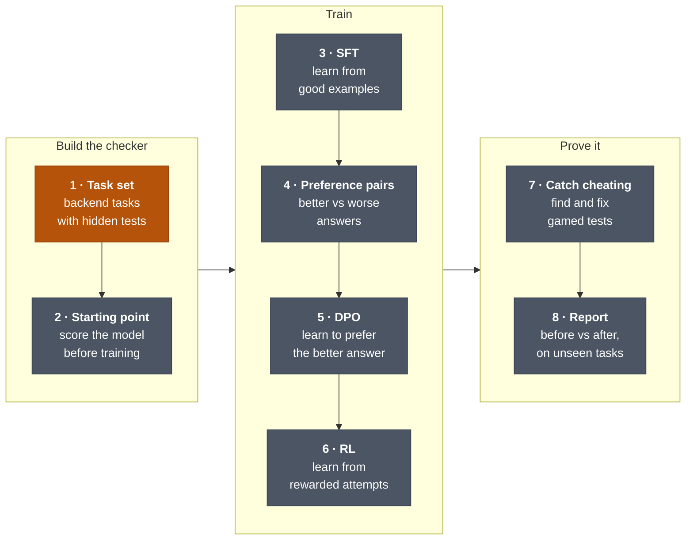
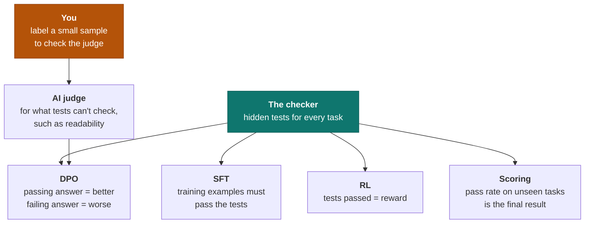
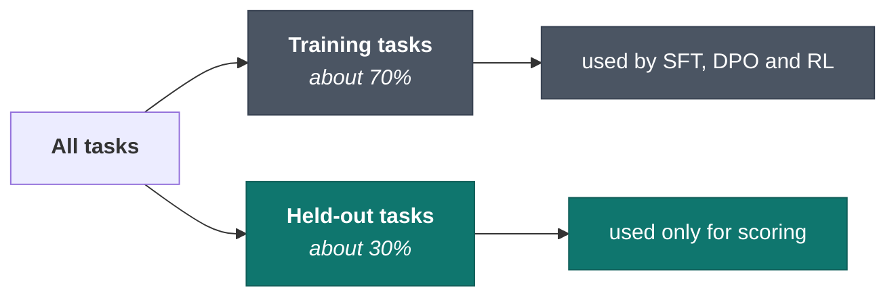
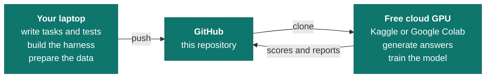
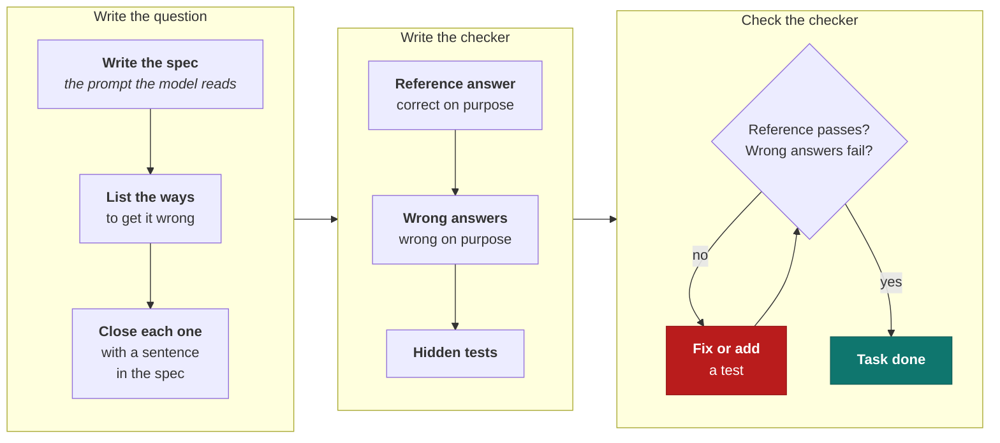
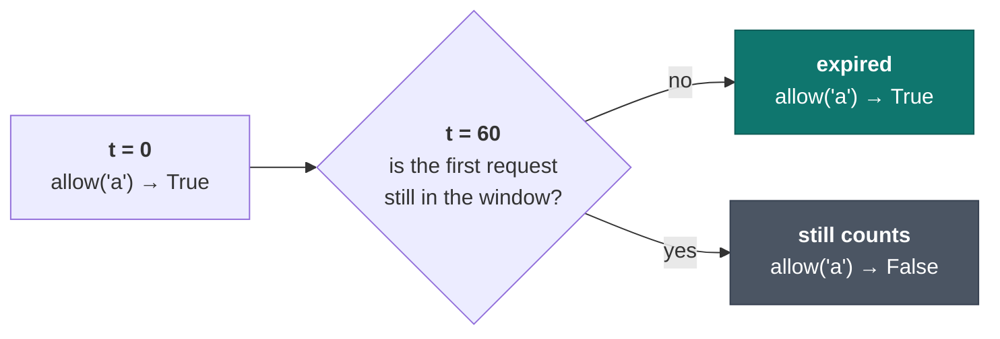
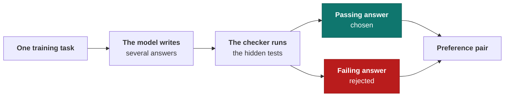
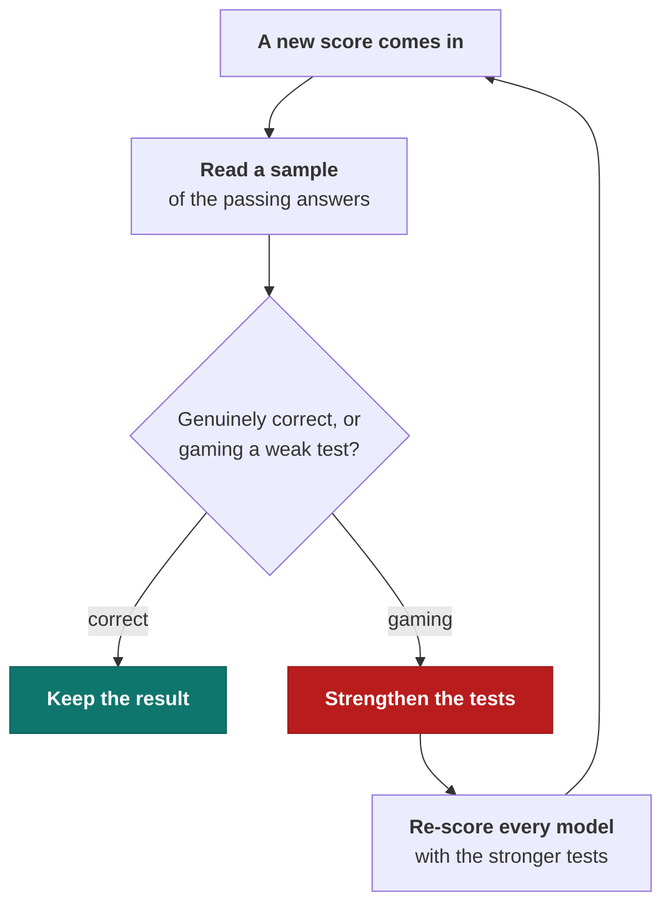
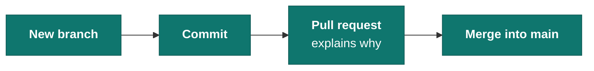

# Roadmap

**Goal:** make a small open coding model measurably better at backend work, and prove it with
scoring the model can't cheat.

This document is the plan, step by step. Each step says what to do, what you'll have at the end,
and how you know it's done. Work top to bottom and tick the boxes as you go.

---

## The big picture



<sub>Orange: in progress. Grey: not started.</sub>

After every training step (3, 5 and 6) the model is scored again the same way, so each step's
effect can be measured on its own.

## The four skills, in plain words

These are the skills the roles we're targeting ask for, and where this project shows each one.

| Skill | In plain words | Where it happens |
|---|---|---|
| **Supervised fine-tuning (SFT)** | show the model good examples until it copies them | step 3 |
| **Preference optimization (DPO)** | show it "this answer is better than that one" until it prefers the better kind | steps 4–5 |
| **RLHF / RLAIF** | let it try, score each try, reward the good ones; scores come from people (HF) or another AI (AIF) | steps 4 and 6 |
| **Domain adaptation** | make a general model good at one area | the whole project: the area is backend work |

## One idea holds it all together: the checker

Every task has hidden tests. Those tests are the checker, and every step depends on them.



**If the checker is weak, every step learns the wrong thing.** That's the lesson from the LRU cache
example in this repo: four obvious tests gave a broken cache a perfect 4/4.

## Rule one: never score on what the model studied



A model scored on tasks it trained on has memorised them. The score would be meaningless. Each
task is marked training or held-out when it's created, and that label never changes.

## Where everything runs

This laptop has no GPU, so the work is split:



Trained model files are large and stay out of Git. Only code, data, scores and reports are
committed.

This repository is private, so a Kaggle or Colab notebook can only clone it with a GitHub access
token. Keep the token in the notebook's secrets, never in a committed file.

---

## Step 1 · Build the task set `IN PROGRESS`

**Goal:** 30–50 small backend coding tasks, each with a spec, hidden tests and a reference answer.

**Why it comes first:** everything later learns from these tasks and is scored by them.

**You'll have:** one folder per task in `tasks/`, the same shape as `tasks/lru-cache/`.

### How one task gets made



The spec is the prompt. If it's vague, a model that reads it differently isn't wrong. We are.

### Checklist

- [ ] Rate limiter, the first task (in progress, see below)
- [ ] More tasks, for example: pagination, retry with backoff, input validation, request
      deduplication, cursor encoding, config parsing
- [ ] Mark every task as training or held-out

### The first task: a rate limiter

The model will write a class that behaves like this:

```python
limiter = RateLimiter(limit=100, window_seconds=60, clock=...)

limiter.allow("user-42")   # True  -> let the request through
limiter.allow("user-42")   # False -> reject it (an API would return 429)
```

Each decision below closes one way the model could reasonably read the spec differently.

| # | Question | Decision |
|---|---|---|
| 1 | Fixed window or sliding window? | **Sliding window.** A client can't squeeze 200 requests into one second when the minute rolls over. |
| 2 | Exact count, or an approximation? | **Exact.** An approximation can let a few extra requests through, and then no test can say what "correct" is. |
| 3 | Is a request exactly `window_seconds` old still in the window? | **Open.** Recommended: no, it has expired. |
| 4 | How do tests control time? | Next |
| 5 | What about `limit` of 0, negative, or not a number? | Later |
| 6 | Is the limit counted separately for each key? | Later |
| 7 | Do rejected requests count toward the limit? | Later |
| 8 | Are old timestamps and idle keys cleaned up, so memory doesn't grow forever? | Later |

**The open question (3), drawn out.** With `limit=1` and `window_seconds=60`:



Both answers are reasonable, so the spec has to pick one. A test at exactly t = 60 needs full
control of time, which is why the interface takes a `clock` (question 4).

---

## Step 2 · Measure the starting point

**Goal:** score the model before any training, so later scores have something to be compared with.

- [ ] Pick the model: start with a coding model of about 0.5B parameters, such as
      Qwen2.5-Coder-0.5B-Instruct
- [ ] Have it answer every held-out task several times
- [ ] Run every answer through the checker, **inside the sandbox**
- [ ] Record the pass rate

**Done when:** you have one pass rate you could defend.

**Why the sandbox is needed here:** from this step on, the code being tested was written by a
model, not by us. The README shows a candidate that stops the current runner with one line.
Running model code without isolation isn't safe.

## Step 3 · SFT: learn from good examples

**Goal:** teach the model by showing it correct answers.

- [ ] Turn each training task into an example: spec in, reference answer out
- [ ] Fine-tune with LoRA, which trains a small add-on instead of the whole model, on a cloud GPU
- [ ] Score on the held-out tasks

**Done when:** you can compare this score with step 2.

**Tools:** Hugging Face `transformers`, `trl` for training, `peft` for LoRA.

## Step 4 · Build preference pairs

**Goal:** a dataset of "better answer / worse answer" pairs.



- [ ] Have the model answer each training task several times
- [ ] Pair a passing answer with a failing one
- [ ] When both answers pass, ask an AI judge which is clearer
- [ ] Label about 50 pairs yourself and measure how often the judge agrees with you

**Done when:** you have the pair dataset, and a number for how far the judge can be trusted.

## Step 5 · DPO: learn to prefer the better answer

**Goal:** train on the pairs from step 4.

- [ ] Train with DPO, starting from the step 3 model
- [ ] Score on the held-out tasks

**Done when:** you can compare this score with steps 2 and 3.

## Step 6 · RL: learn from rewarded attempts (optional)

**Goal:** let the model practise, with the tests deciding the reward.

- [ ] Reward = how many hidden tests an answer passes
- [ ] Train, for example with TRL's GRPO trainer
- [ ] Score on the held-out tasks

This is the heaviest step and needs the most GPU time, so it's optional. It's the same idea as
RLHF, with the tests giving the reward instead of people.

## Step 7 · Catch the cheating

**Goal:** make sure a higher score means better code, not better cheating.



What cheating looks like:

- returning fixed answers that match the examples in the spec
- spotting a test's inputs and special-casing them
- catching every error so the code never crashes, while giving wrong answers

- [ ] Review passing answers from each trained model
- [ ] Record every trick found and the test that now catches it

**Done when:** no trick you find still passes.

## Step 8 · Report

**Goal:** one honest page showing what each step changed.

| Model | Held-out pass rate | Change |
|---|---|---|
| Starting model | | |
| + SFT | | |
| + DPO | | |
| + RL | | |

The report also states:

- [ ] that no held-out task appeared in any training data
- [ ] every cheating trick found, and how it was fixed
- [ ] how often the AI judge agreed with human labels

---

## Rules we keep

1. **Score only on held-out tasks.**
2. **A test is only useful if a real answer can fail it.**
3. **The spec is the prompt.** If it's vague, the mistake is ours, not the model's.
4. **Model-written code is untrusted.** It always runs in the sandbox.
5. **A higher score is a question, not a result.** Check it isn't cheating first.

## How we work

Every change goes on its own branch and into `main` through a pull request:


